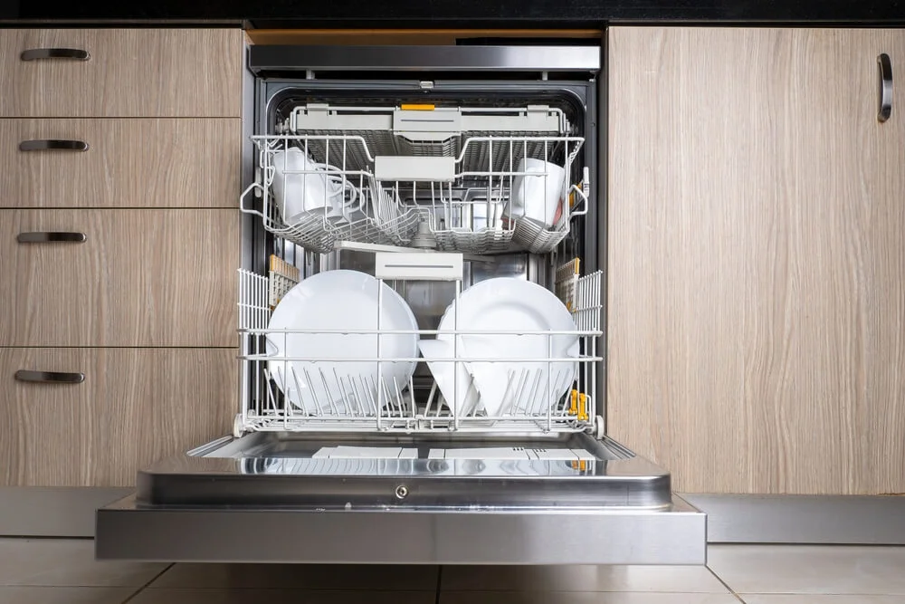

+++
title = "Life Hacks In Germany"
date = 2024-08-30T23:03:48+02:00
description = ""
draft = false
subtitle = ""
header_img = ""
toc = false
tags = []
categories = []
series = ["Others"]
comment = true
+++

There are few things that improved the quality of life (for me) in Germany. They are not that expensive, but delivered a high performance.

# 1. Floor Mat
During the winter time, it was uncomfortable to walk on the naked floor. 
The floor mat to cover the entire living room and the kitchen cost ~€95, which improved the living condition by a great magnitude.
The important thing is to cover the entire floor, not just covering a partial area with a standard sized mat.
  

# 2. Dishwasher
On a regular day, my wife spends about 40 min for washing the dishes in the afternoon, and I spend about 30 min in the evening.
We bought a dishwasher upon friends recommendations. 
It is a real game changer! It spares us from doing most of the cleaning work.
### Advantages other than saving time:
* Uses less water: So the drainage water will also be less, so less problem of clogging.
* Uses electricity to heat the water: Using the heat water provided by the house may be expensive depending on the heating mechanism (oil/gas).

  
