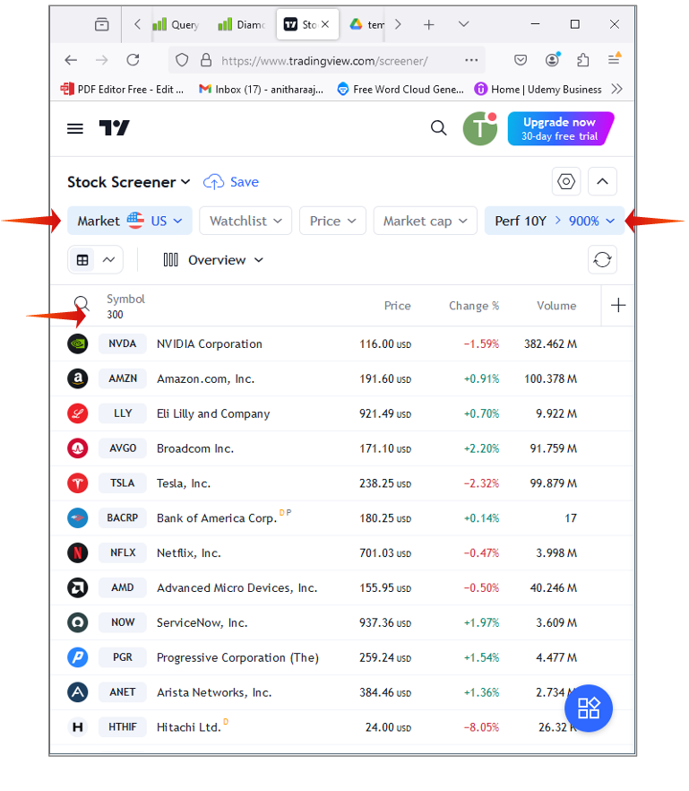

+++
title = "Markets Compare"
date = 2024-09-22T18:28:10+02:00
description = ""
draft = false
subtitle = ""
header_img = ""
toc = false
tags = ["US", "India", "Japan"]
categories = []
series = ["Finance"]
comment = true
+++

## Goal:
To find out which market is best for a dumb long term investor OR to a monkey investor who throws a stone at the wall and picks the stock on it.

## Criteria:
Return of the stock in last 10 year period from today (2024-Sep-22).

## Resource:
https://www.tradingview.com/screener/ gives a good overview of the metrics.

## Results
An example screenshot of the American Stock market result is given below. 
The same analysis is performed on the other markets.
 

| Market   | Total Companies (t) | >10x in 10 years (g) | Ratio in % (g/t) | 
| --------  | --------           | ------           | ------      |
| USA | 13740 | 300 | 2.2 |
| India | 6700 | 1052 | 15.7 |
| Germany | 18530 | 502 | 2.7 |
| Japan | 4026 | 42 | 1.0 |
| Canada | 5392 | 121 | 2.2 |
| Hong Kong | 2464 | 10 | 0.4 | 
| UK | 4356 | 50 | 1.1 | 
| Taiwan | 2219 | 40 | 1.8 | 
| Czech Republic | 52 | 0 | 0 | 
| Switzerland | 718 | 3 | 0.42 | 
| Russia | 254 | 42 | 16.54 | 
| Turkey | 568 | 321 | 56.51 | 
| Italy | 1216 | 10 | 0.82 | 
| UAE | 147 | 2 | 1.36 | 
| Saudi Arabia | 338 | 5 | 1.48 | 
| Qatar | 54 | 0 | 0 | 
| Egypt | 246 | 24 | 9.76 | 
| Nigeria | 131 | 6 | 4.58 | 
| Bangladesh | 394 | 8 | 2.03 | 
| Malaysia | 1037 | 15 | 1.45 | 
| Singapore | 550 | 2 | 0.36 | 
| South Korea | 2714 | 29 | 1.07 | 
| Indonesia | 858 | 21 | 2.45 | 
| Thailand | 1789 | 6 | 0.34 | 
| Pakistan | 467 | 22 | 4.71 | 
| France | 652 | 4 | 0.61 | 
| Sweden | 1194 | 33 | 2.76 | 
| Denmark | 161 | 4 | 2.48 | 
| Brazil | 1938 | 78 | 4.02 | 
| New Zealand | 118 | 0 | 0 | 
| Mexico | 1760 | 20 | 1.14 | 
| Sri Lanka | 288 | 3 | 1.04 | 
| Austria | 807 | 12 | 1.49 | 
| Lithuania | 28 | 0 | 0 | 
| Belgium | 116 | 4 | 3.45 | 
| Latvia | 10 | 0 | 0 | 
| Luxembourg | 121 | 1 | 0.83 | 
| Cyprus | 36 | 3 | 8.33 | 
| Netherlands | 110 | 3 | 2.73 | 
| Norway | 325 | 4 | 1.23 | 
| Poland | 747 | 25 | 3.35 | 
| Portugal | 39 | 0 | 0 | 
| Estonia | 30 | 0 | 0 | 
| Serbia | 21 | 3 | 14.29 | 
| Spain | 248 | 2 | 0.81 | 
| Finland | 192 | 2 | 1.04 | 
| Romania | 222 | 22 | 9.91 | 
| Greece | 146 | 6 | 4.11 | 
| Slovakia | 6 | 0 | 0 | 
| Hungary | 72 | 6 | 8.33 | 
| Iceland | 31 | 1 | 3.23 | 
| Morocco | 71 | 1 | 1.41 | 
| Bahrain | 22 | 4 | 18.18 | 
| Israel | 518 | 25 | 4.83 | 
| Kenya | 54 | 2 | 3.7 | 
| Tunisia | 72 | 0 | 0 | 
| Kuwait | 140 | 0 | 0 | 
| South Africa | 263 | 2 | 0.76 | 
| Argentina | 566 | 254 | 44.88 | 
| Peru | 116 | 4 | 3.45 | 
| Colombia | 99 | 13 | 13.13 | 
| Vaenezuela | 20 | 15 | 75 | 
| Australia | 1895 | 52 | 2.74 | 
| Philippines | 302 | 3 | 0.99 | 
| Vietnam | 1230 | 21 | 1.71 | 

## Exceptions
1. The companies which went bankrupt in the timeframe are not considered.
2. There may be multiple listings of the same company in different stock exchanges. 
   E.g: HDFC Bank Ltd is listed in BSE and NSE. Both are considered for evaluation.

